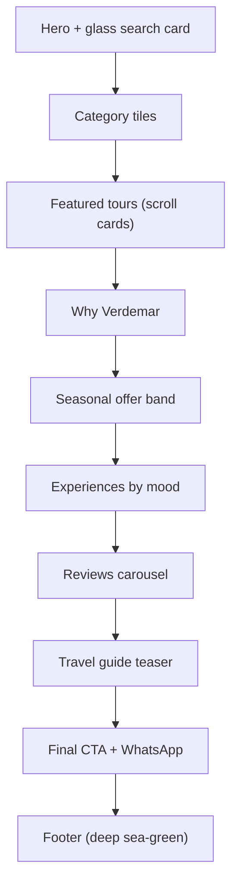
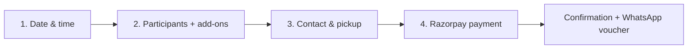

# Verdemar Goa — Website Design Specification

_Last updated: Aug 5, 2026_

> **Brand name chosen:** **Lehar Goa** (_lehar_ = "wave" in Hindi — instantly familiar to Indian travellers, evokes the sea, easy to say and spell).
> Tagline: **"Ride the green tide of Goa."**

The design direction is **coastal, airy, and premium**: lots of white space, soft glass panels, emerald-green accents, and full-bleed sea photography. Built on the latest lightweight web tech for speed on mobile.

### Why this name (Indian-friendly shortlist)

- **Lehar** (recommended) — Hindi for "wave". Pan-Indian, warm, memorable, sea-themed.
- **Harit Sagar** — literally "green sea" in Hindi; the exact meaning of the theme.
- **Susegad Goa** — beloved Konkani word for relaxed contentment; very authentically Goan.
- **Sagar / Neel Lehar** — "sea" / "blue wave"; simple and evocative.
- **Tarang** — "ripples/waves"; short and modern.

---

## 1. Brand Identity

- **Name:** Lehar Goa
- **Logo idea:** A rounded modern-sans wordmark "lehar", with a small wave glyph forming the base of the letter "l" or dotting the letter. Emerald-to-teal gradient mark. A subtle Devanagari touch (लहर) can appear as a secondary mark for Indian resonance.
- **Voice:** Friendly, confident, local expert. Short sentences. No hard sell.

### Color palette (emerald + whitish + sea) — confirmed: emerald primary

- `--sea-deep: #0B5E5A` (deep teal-green — headings, footer)
- `--emerald: #10897B` (primary brand / buttons) ← **confirmed primary**
- `--mint: #6FCF97` (accents, success, highlights)
- `--sea-glass: #DCEFEA` (soft panel tint)
- `--foam: #F6FBF9` (page background, near-white)
- `--sand: #FBF7EF` (alternate section background)
- `--ink: #12332F` (body text)
- `--muted: #5B726E` (secondary text)
- `--white: #FFFFFF`

Gradient for hero/buttons: `linear-gradient(135deg, #10897B 0%, #0B5E5A 60%, #073E3A 100%)` with subtle mint glow.

### Spacing & radius scale

- Spacing scale (4px base): 4, 8, 12, 16, 24, 32, 48, 64, 96px.
- Radius: sm 8px, md 16px, lg 24px, pill 999px.
- Shadows: soft `0 8px 30px rgba(11,94,90,0.08)` for glass cards; stronger on hover.

### Typography (variable fonts, self-hosted, light payload)

- **Display / headings:** _Clash Display_ or _Sora_ (bold, modern, rounded)
- **Body / UI:** _Inter_ variable (excellent legibility, small size)
- Fluid type scale using CSS `clamp()` so text scales smoothly on all screens.

### Visual language

- Rounded corners (16–24px), soft shadows, **glassmorphism** cards over sea photos.
- Generous whitespace, thin 1px hairline borders in `--sea-glass`.
- Micro-interactions: gentle hover lift, fade-up on scroll, animated gradient underline on links.

---

## 2. Technology (latest, lightweight)

- **Framework:** Next.js 15 (App Router) + React 19 — server components keep JS bundle tiny.
- **Styling:** Tailwind CSS v4 (new engine, CSS-first config) with custom CSS variables above. Modern CSS: container queries, `clamp()`, `color-mix()`, `:has()`, view transitions.
- **Animation:** Framer Motion for key moments; CSS-only where possible to stay light.
- **Images:** `next/image` + Cloudinary, AVIF/WebP, lazy loading, blur placeholders.
- **Fonts:** self-hosted variable fonts via `next/font` (no layout shift, no external calls).
- **Performance target:** Lighthouse 95+ mobile, LCP < 2.0s, JS < 120KB on first load.

---

## 3. Global Layout

### Header (sticky, glass)

- Translucent `backdrop-blur` bar that turns solid `--foam` on scroll.
- Left: Verdemar logo. Center: Tours / Cruises / Adventure / Packages / About. Right: search icon, WhatsApp button (mint), "Book Now" (emerald gradient).
- Mobile: hamburger → full-screen frosted menu.

### Footer (deep sea-green)

- `--sea-deep` background, mint links, newsletter, WhatsApp + phone, quick links, policies, social, payment badges (Razorpay / UPI / Visa).

---

## 4. Homepage — section by section

1. **Hero (full-bleed):** Drone shot of emerald Goa coastline, dark-green gradient overlay. Big headline "Discover the green side of Goa." Floating glass **search card**: Date · Category · Guests · Search. Trust chips below ("Instant WhatsApp confirmation · Free cancellation · Secure Razorpay").
2. **Popular categories:** Rounded image tiles — Cruises, Scuba, Water Sports, Sightseeing, Dudhsagar, Adventure. Hover lift + zoom.
3. **Featured tours:** Horizontal-scroll cards (glass), each with photo, rating, duration, price, "% OFF" badge, quick "Book".
4. **Why Verdemar:** 3–4 icon features on `--sand` — Local experts, Best price, Verified operators, 24/7 WhatsApp.
5. **Seasonal offer banner:** Emerald gradient band with countdown and CTA.
6. **Experiences by mood:** For Couples / Families / Groups / Adventure-seekers.
7. **Reviews:** Testimonial carousel with soft glass cards, star ratings, Google-verified badges.
8. **Travel guide teaser:** 3 blog cards (SEO) — hidden beaches, budgets, best time to visit.
9. **Big CTA:** "Ready to explore Goa?" with WhatsApp + Book buttons over a sea image.

### Homepage wireframe

---

## 5. Catalogue / Listing Page

- Left (desktop) / top drawer (mobile): filters — category, date, price slider, duration, pickup, private/shared, rating.
- Grid of tour cards (glass, rounded), sortable by popular / price / rating.
- Sticky "results + map toggle" bar. Infinite scroll or "Load more".

---

## 6. Tour Detail Page

- Full-width photo gallery (swipeable, lightbox).
- Sticky **booking card** (right on desktop, bottom bar on mobile): price, date picker, guests, add-ons, "Book Now".
- Content tabs: Overview · Itinerary · Inclusions/Exclusions · Pickup & map · Cancellation · FAQs · Reviews.
- Trust strip: free cancellation, instant confirmation, secure payment.

---

## 7. Booking Flow (4 steps, matches Vacation Labs pattern)

- Clean stepper header, one focused card per step, live price summary, no forced signup, guest checkout, mobile-optimised keyboards.

---

## 8. Components Library

- Buttons (emerald gradient primary, mint secondary, ghost), glass cards, chips/badges, star rating, date picker, guest stepper, price summary, toast, skeleton loaders, modal/lightbox, sticky mobile CTA bar.

---

## 9. Motion & Accessibility

- Fade/slide-up on scroll, hover lift, animated gradient link underline, page view-transitions.
- WCAG AA contrast, focus rings, keyboard nav, `prefers-reduced-motion` respected, alt text on all images.

---

## 10. Deliverables for the Design Phase

- Design tokens file (colors, type, spacing) as CSS variables.
- Figma or coded prototype of: Home, Listing, Tour Detail, Booking flow (mobile + desktop).
- Reusable component kit built in the actual Next.js + Tailwind stack.

---

### Notes / decisions I made for you

- **Name:** Lehar Goa (Hindi "wave", Indian-friendly). Alternates: _Harit Sagar_, _Susegad Goa_, _Neel Lehar_, _Tarang_.
- **Primary color:** Emerald `#10897B` (confirmed) on white/foam, with glassmorphism over sea photography.
- **Stack:** Next.js 15 + Tailwind v4 for a light, fast, modern build.

Confirm the name (or pick an alternate) and I can move to a Figma mockup or a coded homepage prototype.
