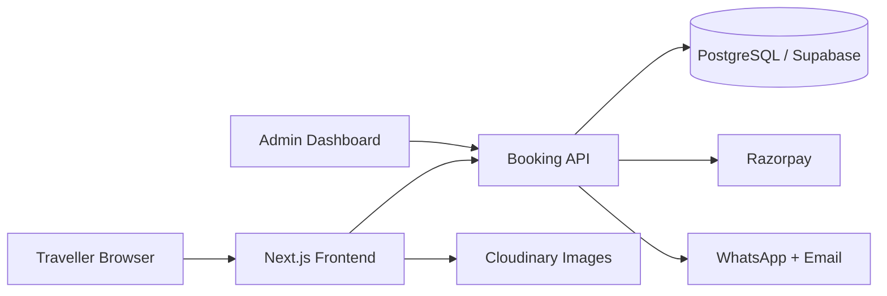

# Goa Travel & Tours Booking Website — Project Plan

_Last updated: Aug 5, 2026_

## Overview

A fast, mobile-first booking website for Goa tours and activities (sightseeing, cruises, scuba diving, water sports, Dudhsagar, adventure, packages, private tours). Focused on a smooth booking flow, secure payments, and WhatsApp-driven support rather than a content-heavy portal.

### Reference sites

- [Goa Safari](https://www.goasafari.com/) — Vacation Labs booking flow (Dates → Details → Participants → Payment)
- [Goa Darshan](https://www.goadarshan.net/collections/goa-tours) — category-based tour catalogue
- [Goa Nine Tales](https://goaninetales.com/) — package + activity marketing site
- Competitors: [GetYourGuide](https://www.getyourguide.com/goa-l825/), [Thrillophilia](https://www.thrillophilia.com/states/goa/tags/day-tours), [Goa Travel Tales](https://goatraveltales.in/), [Goa Trip Package](https://goatrippackage.com/), [Top Goa Tours](https://topgoatours.com/)

---

## Website Plan — 10 Points

1. **Positioning and branding** — Present the business as a trusted local Goa expert with verified tours, transparent pricing, secure payments, and WhatsApp support.
2. **Mobile-first homepage** — Strong search area, popular categories, featured tours, seasonal offers, testimonials, trust indicators, and prominent booking buttons.
3. **Tour catalogue** — Organise experiences into sightseeing, cruises, scuba diving, water sports, Dudhsagar, adventure activities, packages, and private tours.
4. **Search and filters** — Filter by date, category, duration, location, price, pickup availability, traveller type, and private/shared experience.
5. **Detailed tour pages** — Photos, itinerary, timings, inclusions, exclusions, pickup info, requirements, cancellation terms, map, FAQs, and verified reviews.
6. **Simple booking flow** — Four steps: select date/time → participants/add-ons → contact & pickup details → payment & confirmation. No forced account creation.
7. **Payments and confirmation** — Razorpay for UPI, cards, and wallets. Support full payment or deposit, then send vouchers via email and WhatsApp.
8. **Customer confidence** — Real reviews, operator verification, secure-payment messaging, cancellation rules, emergency contact info, and "no hidden charges" pricing.
9. **Admin and operations** — Admin dashboard for tours, prices, availability, bookings, coupons, refunds, enquiries, homepage content, and booking exports.
10. **SEO and growth** — Optimised pages for searches like "scuba diving in Goa" and "Dudhsagar tour". Structured data, analytics, abandoned-booking tracking, WhatsApp conversion tracking, and a travel-guide section.

---

## What I Need From You

- Business name, logo, colours, and contact information
- Domain name and access to the domain account
- Tour list with prices, schedules, capacity, and availability
- Inclusions, exclusions, itineraries, and pickup locations
- Original photographs and videos
- Cancellation, refund, privacy, and terms policies
- Razorpay account and settlement details
- WhatsApp Business number and email address
- Customer reviews you are authorised to publish
- Whether bookings are instantly confirmed or manually approved
- Required languages and currencies
- Examples of designs you like
- Budget and desired launch date

---

## Recommended Implementation

- **Frontend:** Next.js with responsive, SEO-friendly pages
- **Database:** PostgreSQL / Supabase
- **Admin:** Custom lightweight dashboard or headless CMS
- **Payments:** Razorpay
- **Messages:** WhatsApp Business API and transactional email
- **Images:** Cloudinary or object storage with automatic optimisation
- **Hosting:** Vercel with Cloudflare DNS, CDN, and security
- **Monitoring:** Error tracking, uptime alerts, and analytics

**Estimated MVP delivery:** 5–7 weeks, depending on content readiness and booking complexity.

### High-level architecture

---

## Deployment Plan

1. Create development, staging, and production environments.
2. Configure automated testing and preview deployments.
3. Add database migrations, access controls, and encrypted secrets.
4. Connect Razorpay in test mode and validate payment/refund scenarios.
5. Test mobile devices, browsers, SEO, accessibility, and booking notifications.
6. Import tours and complete stakeholder acceptance testing on staging.
7. Configure domain, SSL, CDN, backups, monitoring, and production payments.
8. Launch during a low-traffic period and monitor bookings closely for 48 hours.

---

## Maintenance Plan

- **Daily:** uptime, failed payments, and booking-notification monitoring
- **Weekly:** dependency/security review, backups, and broken-link checks
- **Monthly:** software updates, performance review, analytics, and conversion review
- **Quarterly:** recovery test, access review, SEO/content audit, and usability improvements
- **Seasonally:** update tour availability, pricing, monsoon restrictions, and offers
- Maintain a staging environment and rollback procedure for every release
- Provide an agreed support SLA for urgent booking or payment failures
